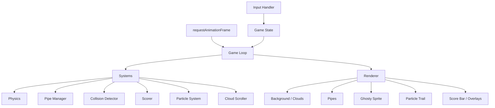
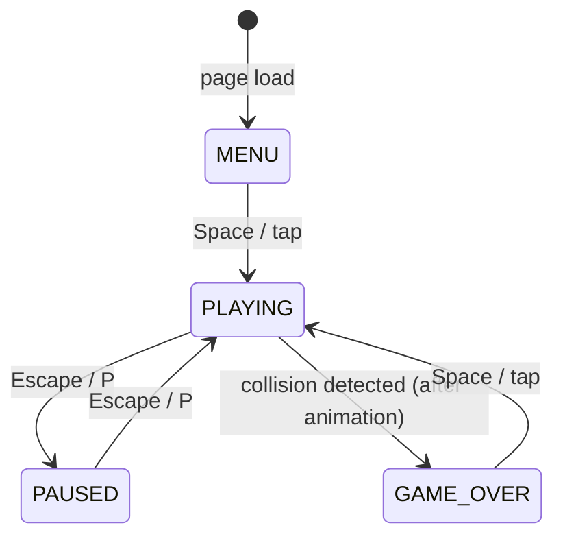

# Design Document: Flappy Kiro

## Overview

Flappy Kiro is a browser-based endless scroller game implemented as a single HTML file with vanilla JavaScript and an HTML5 Canvas. There are no build tools, no frameworks, and no server-side dependencies — the game loads directly from the filesystem or any static host.

The player controls Ghosty, a ghost sprite, navigating through an infinite stream of pipe obstacles. The game features:
- Physics-driven movement (gravity, flap impulse, terminal velocity, interpolated rendering)
- Progressive difficulty via increasing pipe scroll speed
- Parallax cloud background with 2+ layers
- Particle trail emitted from Ghosty during play
- Score popups, collision animation (flash + shake), and invincibility frames
- Persistent high score via `localStorage`
- Background music with graceful fallback
- Responsive canvas scaling to viewport

### Technology Choices

| Concern | Choice | Rationale |
|---|---|---|
| Rendering | HTML5 Canvas 2D API | No DOM overhead; full pixel control; suits retro aesthetic |
| Language | Vanilla ES6+ JS | Zero dependencies; runs directly in browser |
| Audio | Web Audio API / HTMLAudioElement | Simple playback; graceful fallback on missing files |
| Storage | `localStorage` | Persistent, synchronous, no server needed |
| Animation | `requestAnimationFrame` | Browser-native; syncs to display refresh rate |

---

## Architecture

The game is structured across a small set of files with a clear separation between:

1. **`config.js`** — all tunable numerical values and asset paths in one dedicated file, imported by all other modules
2. **State** — a single mutable game state object
3. **Systems** — pure-ish functions that update state (physics, pipes, collision, scoring, particles)
4. **Renderer** — reads state and draws to canvas each frame
5. **Input Handler** — translates keyboard/pointer events into game actions
6. **Game Loop** — orchestrates systems and renderer via `requestAnimationFrame`



### Game State Machine



---

## Components and Interfaces

### game-config.json — Constants Module

All numerical values and asset paths live in `game-config.json` at the project root. The game loads this file at startup and uses it as the single source of truth. To tune the game feel, only `game-config.json` ever needs to change — no code edits required.

Physics values use **time-based units (px/s or px/s²)** so behaviour is consistent at any frame rate. The game loop converts to per-frame deltas using `dt` (seconds elapsed since last frame).

```json
{
  "physics": {
    "gravity": 800,
    "jumpVelocity": -300,
    "terminalVelocity": 600
  },
  "pipes": {
    "wallSpeed": 120,
    "gapSize": 140,
    "wallSpacing": 350,
    "gapMargin": 60,
    "speedIncrement": 20,
    "speedMilestone": 5,
    "maxWallSpeed": 300
  },
  "collision": {
    "hitboxInset": 8,
    "invincibilityMs": 1500
  },
  "visual": {
    "particleDuration": 500,
    "scorePopupDuration": 700,
    "collisionAnimMs": 500
  },
  "audio": {
    "bgMusicPath": "assets/background.mp3"
  },
  "storage": {
    "highScoreKey": "flappyKiroHighScore"
  }
}
```

The game loop applies time-based physics as:
```js
// dt = seconds since last frame (capped at 0.05 to prevent spiral-of-death)
ghosty.vy = Math.min(ghosty.vy + cfg.physics.gravity * dt, cfg.physics.terminalVelocity);
ghosty.y  += ghosty.vy * dt;
pipe.x    -= cfg.pipes.wallSpeed * dt;
```

### Game State Object

```js
const state = {
  gameState: 'MENU',          // 'MENU' | 'PLAYING' | 'PAUSED' | 'GAME_OVER'
  score: 0,
  highScore: 0,
  ghosty: { x, y, vy, prevY },
  pipes: [],                  // array of PipePair
  particles: [],              // array of Particle
  scorePopups: [],            // array of ScorePopup
  clouds: [[], []],           // two Cloud_Layer arrays
  invincibleUntil: 0,         // timestamp ms
  collisionAnim: null,        // CollisionAnimState | null
  pipeSpeed: BASE_PIPE_SPEED,
  lastTimestamp: 0,
  newBest: false,
};
```

### Physics System

Responsible for updating Ghosty's vertical position each frame.

```
updatePhysics(state, dt):
  if gameState !== PLAYING: return
  state.ghosty.prevY = state.ghosty.y
  state.ghosty.vy = clamp(state.ghosty.vy + GRAVITY, -Infinity, TERMINAL_VELOCITY)
  state.ghosty.y += state.ghosty.vy
  // ceiling clamp
  state.ghosty.y = max(state.ghosty.y, 0)
```

### Pipe Manager

Handles pipe scrolling, recycling, and spawning.

```
updatePipes(state):
  scroll all pipes left by pipeSpeed
  remove pipes that have exited left edge
  if rightmost pipe x < canvas.width - PIPE_SPACING: spawnPipe()

spawnPipe():
  gapCenterY = random in [GAP_MARGIN + GAP_SIZE/2, canvas.height - SCORE_BAR_H - GAP_MARGIN - GAP_SIZE/2]
  push new PipePair { x: canvas.width, gapCenterY, scored: false }
```

### Collision Detector

Ghosty uses a **circular hitbox** (feels fairer for a round ghost sprite). Pipes use **rectangular bounds**. Ground and ceiling use simple y-threshold checks.

```
getCircleHitbox(ghosty, spriteW, spriteH):
  cx = ghosty.x + spriteW / 2
  cy = ghosty.y + spriteH / 2
  r  = (min(spriteW, spriteH) / 2) - HITBOX_INSET
  return { cx, cy, r }

circleOverlapsRect(cx, cy, r, rect):
  // clamp circle centre to nearest point on rect
  nearestX = clamp(cx, rect.x, rect.x + rect.w)
  nearestY = clamp(cy, rect.y, rect.y + rect.h)
  dx = cx - nearestX
  dy = cy - nearestY
  return (dx*dx + dy*dy) <= r*r

checkCollisions(state, now):
  if now < state.invincibleUntil: return
  { cx, cy, r } = getCircleHitbox(state.ghosty, SPRITE_W, SPRITE_H)

  // Wall collision — circle vs pipe rectangles
  for each pipe in state.pipes:
    if circleOverlapsRect(cx, cy, r, pipe.topRect): triggerCollision(state); return
    if circleOverlapsRect(cx, cy, r, pipe.bottomRect): triggerCollision(state); return

  // Ground collision
  if cy + r >= canvas.height - SCORE_BAR_H: triggerCollision(state); return

  // Ceiling collision
  if cy - r <= 0: triggerCollision(state)
```

### Scorer

```
checkScoring(state):
  for each pipe in state.pipes:
    if not pipe.scored and ghosty.x > pipe.x + PIPE_WIDTH / 2:
      pipe.scored = true
      state.score++
      spawnScorePopup(state)
      playScoreSound()
      if state.score % SPEED_MILESTONE === 0:
        state.pipeSpeed = min(state.pipeSpeed + SPEED_INCREMENT, MAX_PIPE_SPEED)
```

### Particle System

```
emitParticle(state):
  push { x: ghosty.x, y: ghosty.y, born: now, duration: PARTICLE_DURATION }

updateParticles(state, now):
  remove particles where (now - born) >= duration
```

### Cloud Scroller

Two layers with different speeds. Clouds wrap around when they exit the left edge.

```
CLOUD_LAYERS = [
  { speed: 0.3, clouds: [...] },  // far background
  { speed: 0.7, clouds: [...] },  // near background
]

updateClouds(state):
  always runs regardless of gameState (continues during PAUSED)
  for each layer: scroll clouds left by layer.speed; wrap at left edge
```

### Renderer

Draws in z-order each frame:
1. Sky background (light blue fill + sketchy texture)
2. Cloud layers (back to front)
3. Pipes (green rect + darker cap)
4. Particle trail
5. Ghosty sprite (rotated by vy)
6. Score popups
7. Score bar (bottom strip)
8. State overlay (MENU / PAUSED / GAME_OVER)
9. Collision animation (flash + shake offset applied to canvas transform)

### Input Handler

```
onKeyDown(e):
  if e.code === 'Space': handleAction()
  if e.code === 'Escape' or 'KeyP': handlePause()

onPointerDown(e):
  handleAction()

handleAction():
  MENU      → startGame()
  PLAYING   → flap()
  GAME_OVER → restartGame()
  PAUSED    → (ignored)

handlePause():
  PLAYING → pauseGame()
  PAUSED  → resumeGame()
```

### Audio Manager

```
AudioManager:
  sounds: { jump, gameOver, score, bgMusic }
  load(path) → HTMLAudioElement (silent fail on error)
  play(sound) → restarts from 0 (silent fail)
  playBgMusic() / pauseBgMusic() / stopBgMusic()
```

---

## Data Models

### PipePair

```ts
interface PipePair {
  x: number;          // left edge x position
  gapCenterY: number; // vertical center of the gap
  scored: boolean;    // whether this pair has already awarded a point
}
```

Derived geometry (computed on demand):
```
topRect    = { x, y: 0,                    w: PIPE_WIDTH, h: gapCenterY - GAP_SIZE/2 }
bottomRect = { x, y: gapCenterY + GAP_SIZE/2, w: PIPE_WIDTH, h: canvas.height - (gapCenterY + GAP_SIZE/2) }
```

### Ghosty

```ts
interface Ghosty {
  x: number;      // fixed horizontal position (canvas center-left)
  y: number;      // current physics y (top of sprite)
  prevY: number;  // y from previous frame (for interpolation)
  vy: number;     // vertical velocity (px/frame, positive = down)
}
```

### Particle

```ts
interface Particle {
  x: number;
  y: number;
  born: number;       // timestamp ms
  duration: number;   // lifetime ms (≤ PARTICLE_DURATION)
}
```

### ScorePopup

```ts
interface ScorePopup {
  x: number;
  y: number;          // starting y
  born: number;       // timestamp ms
  duration: number;   // lifetime ms (≤ SCORE_POPUP_DURATION)
}
```

### Cloud

```ts
interface Cloud {
  x: number;
  y: number;
  width: number;
  height: number;
  opacity: number;    // strictly < 1.0
}
```

### CollisionAnimState

```ts
interface CollisionAnimState {
  startTime: number;  // timestamp ms when animation began
  phase: 'flash' | 'shake';
}
```

### localStorage Schema

```
Key:   'flappyKiroHighScore'   (defined as HS_STORAGE_KEY constant)
Value: string representation of a non-negative integer
```

Read logic:
1. `localStorage.getItem(HS_STORAGE_KEY)`
2. Parse as integer
3. If missing → 0
4. If not a non-negative integer → 0, overwrite with `'0'`


---

## Correctness Properties

*A property is a characteristic or behavior that should hold true across all valid executions of a system — essentially, a formal statement about what the system should do. Properties serve as the bridge between human-readable specifications and machine-verifiable correctness guarantees.*

### Property 1: Physics step integrates gravity and position correctly

*For any* Ghosty state with an arbitrary vertical velocity `vy` and position `y`, after one physics step the new velocity should be `clamp(vy + GRAVITY, -Infinity, TERMINAL_VELOCITY)` and the new position should be `y + new_vy` (subject to ceiling clamp at 0).

**Validates: Requirements 2.1, 2.3, 2.7**

### Property 2: Flap always sets velocity to Flap_Velocity

*For any* current vertical velocity value (positive, negative, or zero), after a flap action Ghosty's `vy` should equal exactly `FLAP_VELOCITY`, replacing the previous value entirely.

**Validates: Requirements 2.2**

### Property 3: Terminal velocity is never exceeded

*For any* sequence of physics steps without a flap, Ghosty's downward vertical velocity should never exceed `TERMINAL_VELOCITY`, regardless of how many frames have elapsed.

**Validates: Requirements 2.4**

### Property 4: Interpolated render position is a blend of previous and current

*For any* previous position `prevY`, current position `y`, and interpolation alpha `α ∈ [0, 1]`, the rendered y should equal `prevY + (y - prevY) * α`, always lying between `prevY` and `y`.

**Validates: Requirements 2.5**

### Property 5: Pipes scroll left by exactly Pipe_Speed each frame

*For any* pipe at horizontal position `x` and any `pipeSpeed` value, after one update step the pipe's x should equal `x - pipeSpeed`.

**Validates: Requirements 3.1**

### Property 6: Generated pipe gap is exactly Gap_Size

*For any* generated pipe pair, the vertical distance between the bottom of the top pipe rectangle and the top of the bottom pipe rectangle should equal exactly `GAP_SIZE` pixels.

**Validates: Requirements 3.7**

### Property 7: Generated pipe gap centre is within Safe_Zone

*For any* generated pipe pair, the gap centre y should satisfy `GAP_MARGIN + GAP_SIZE/2 ≤ gapCenterY ≤ canvas.height - SCORE_BAR_HEIGHT - GAP_MARGIN - GAP_SIZE/2`, ensuring the gap is fully visible with margin.

**Validates: Requirements 3.8**

### Property 8: Pipe speed increases at score milestones and is capped

*For any* score value that is a positive multiple of `SPEED_MILESTONE`, the pipe speed after the scoring event should be `min(previous_speed + SPEED_INCREMENT, MAX_PIPE_SPEED)`, and for all other score values it should remain unchanged.

**Validates: Requirements 3.10, 3.11**

### Property 9: Ghosty circular hitbox is correctly derived from sprite bounds

*For any* Ghosty position `(x, y)` with sprite dimensions `(w, h)`, the computed circle hitbox should have centre `cx = x + w/2`, `cy = y + h/2`, and radius `r = min(w, h)/2 - HITBOX_INSET`.

**Validates: Requirements 4.1, 4.2**

### Property 10: Collision is detected for all boundary and pipe overlaps

*For any* Ghosty circle hitbox `(cx, cy, r)` that overlaps a pipe rectangle (circle-AABB test), or where `cy + r >= ground` or `cy - r <= 0` — and the invincibility window is not active — a collision should be triggered. Conversely, when the circle does not overlap any obstacle and is within bounds, no collision should be triggered.

**Validates: Requirements 4.3, 4.4, 4.5, 4.6**

### Property 11: Invincibility window prevents collision detection

*For any* Ghosty position that would normally trigger a collision, if the current timestamp is less than `invincibleUntil`, no collision should be triggered.

**Validates: Requirements 4.6, 4.8**

### Property 12: High score is updated when current score exceeds it

*For any* current score `s` and stored high score `h`, after a collision where `s > h`, the in-memory high score should equal `s`. When `s ≤ h`, the high score should remain `h`.

**Validates: Requirements 4.13**

### Property 13: Scoring increments by exactly 1 per pipe passed

*For any* pipe pair that Ghosty passes (ghosty.x crosses the pipe midpoint) without a collision, the score should increase by exactly 1, and the pipe's `scored` flag should be set to prevent double-counting.

**Validates: Requirements 5.1**

### Property 14: Score bar displays high score across all game states

*For any* game state (MENU, PLAYING, PAUSED, GAME_OVER) and any high score value, the rendered score bar output should contain the high score value.

**Validates: Requirements 5.3**

### Property 15: Pipe movement and Ghosty physics halt while paused

*For any* game state snapshot when entering PAUSED, after any number of update ticks while remaining in PAUSED state, all pipe x-positions and Ghosty's y-position and vy should remain unchanged.

**Validates: Requirements 6.4**

### Property 16: Clouds continue scrolling while paused

*For any* cloud position when entering PAUSED state, after one or more update ticks the cloud positions should have advanced leftward (and wrapped if necessary), demonstrating that cloud animation is independent of game state.

**Validates: Requirements 6.3, 11.6**

### Property 17: Flap input is ignored while paused

*For any* Ghosty velocity when the game is PAUSED, calling the flap handler should leave `vy` unchanged.

**Validates: Requirements 6.6**

### Property 18: High score is persisted to localStorage when beaten

*For any* current score `s` and stored high score `h` where `s > h`, after a collision the value stored in `localStorage` under `HS_STORAGE_KEY` should equal `s`.

**Validates: Requirements 8.1**

### Property 19: Corrupt or missing localStorage value defaults to 0

*For any* value in localStorage that is not a non-negative integer (including missing, `null`, negative numbers, floats, or non-numeric strings), the initialised high score should be 0 and the stored value should be overwritten with `'0'`.

**Validates: Requirements 8.3, 8.4**

### Property 20: Ghosty sprite rotation reflects velocity direction

*For any* vertical velocity `vy`, the computed rotation angle applied to Ghosty's sprite should be positive (tilting down) when `vy > 0` and zero or negative (level/tilting up) when `vy ≤ 0`.

**Validates: Requirements 9.5**

### Property 21: Particle lifecycle — emission and expiry

*For any* frame while PLAYING, at least one particle should be emitted at Ghosty's current position. *For any* particle whose age `(now - born) ≥ PARTICLE_DURATION`, it should be removed from the active particles array on the next update.

**Validates: Requirements 9.7, 9.8**

### Property 22: Score popup is created on score increment and expires after duration

*For any* scoring event, a new ScorePopup should be added to the popups array. *For any* popup whose age `(now - born) ≥ SCORE_POPUP_DURATION`, it should be removed from the active popups array on the next update.

**Validates: Requirements 9.9**

### Property 23: Cloud layers scroll at distinct speeds

*For any* two cloud layers, their scroll speeds should be strictly different, with the layer intended to be further in the background having a lower speed than the nearer layer.

**Validates: Requirements 11.2**

### Property 24: All clouds have opacity strictly less than 1.0

*For any* cloud in any layer, its opacity value should satisfy `0 < opacity < 1.0`.

**Validates: Requirements 11.3**

### Property 25: Clouds wrap from left edge to right edge

*For any* cloud whose x-position has moved past the left edge of the canvas (x + cloud.width < 0), after the next cloud update step the cloud should be repositioned to the right edge of the canvas.

**Validates: Requirements 11.4**

---

## Performance Optimizations

### Target: 60 FPS

The game loop uses `requestAnimationFrame` which syncs to the display refresh rate. To sustain 60 FPS:

- All per-frame work must complete within **~16ms**
- No allocations in the hot path (game loop, physics, collision, rendering)
- Canvas state changes (`save`/`restore`, `globalAlpha`, transforms) are minimised and batched

### Object Pooling

Creating and garbage-collecting objects every frame causes GC pauses that break frame timing. All short-lived objects use **pre-allocated pools** with a fixed maximum size.

```js
// Pool pattern used for Particles and ScorePopups
class Pool {
  constructor(maxSize, factory) {
    this._pool = Array.from({ length: maxSize }, factory);
    this._active = [];
  }
  acquire() {
    return this._pool.length ? this._pool.pop() : null; // drop if pool exhausted
  }
  release(obj) {
    this._active.splice(this._active.indexOf(obj), 1);
    this._pool.push(obj);
  }
}
```

| Pool | Max size | Rationale |
|---|---|---|
| `ParticlePool` | 60 | ~1 particle/frame × 500ms lifetime = max ~30 active; 60 gives headroom |
| `ScorePopupPool` | 8 | Score events are infrequent; 8 is more than sufficient |
| `PipePairPool` | 6 | At most 4–5 pipes visible at once; pool avoids alloc on recycle |

Pipes are recycled rather than destroyed: when a `PipePair` exits the left edge it is reset and returned to the pool, then re-acquired when a new pair is needed.

### Sprite Batching

The Canvas 2D API has no native sprite batching, but draw call overhead is minimised by:

- Drawing all pipes in a single loop without changing fill style between same-coloured segments
- Setting `globalAlpha` once per cloud layer rather than per cloud where opacity is uniform within a layer
- Caching the sketchy background to an **offscreen canvas** at init time and blitting it each frame with a single `drawImage` call instead of re-drawing strokes

```js
// Background pre-render (done once at init)
const bgCanvas = document.createElement('canvas');
const bgCtx = bgCanvas.getContext('2d');
drawSketchyBackground(bgCtx, width, height);

// Each frame — single blit
ctx.drawImage(bgCanvas, 0, 0);
```

### Memory Management

- Particle and popup arrays are filtered in-place using index-based iteration (no `filter()` which allocates a new array each frame)
- Cloud arrays are fixed-size at init; no clouds are ever added or removed, only repositioned
- `PipePair` objects are pooled and mutated in place; no new objects are created during gameplay
- String concatenation for score display uses a pre-allocated template; the score bar text is only re-rendered when the score value changes (dirty flag)

### Frame Budget Breakdown (target 16ms)

| System | Budget |
|---|---|
| Physics + collision | ~1ms |
| Pipe + cloud update | ~1ms |
| Particle + popup update | ~1ms |
| Background blit | ~1ms |
| Pipe rendering | ~2ms |
| Ghosty sprite draw | ~1ms |
| Particle trail render | ~3ms |
| UI / overlays | ~1ms |
| **Total** | **~11ms** (5ms headroom) |

---

## Error Handling

### Audio Failures

All audio loading and playback is wrapped in try/catch or `.catch()` handlers. If any audio asset fails to load or play, the game continues silently — no error is shown to the player. The `AudioManager` stores a `loaded` flag per sound; play calls are no-ops when `loaded === false`.

```js
function loadSound(path) {
  const audio = new Audio();
  audio.onerror = () => { audio._failed = true; };
  audio.src = path;
  return audio;
}

function playSound(audio) {
  if (!audio || audio._failed) return;
  try {
    audio.currentTime = 0;
    audio.play().catch(() => {});
  } catch (_) {}
}
```

### localStorage Failures

`localStorage` access is wrapped in try/catch to handle private browsing modes or storage quota errors. If reading fails, `highScore` defaults to 0. If writing fails, the in-memory value is still updated.

```js
function readHighScore() {
  try {
    const raw = localStorage.getItem(HS_STORAGE_KEY);
    const n = parseInt(raw, 10);
    if (!Number.isInteger(n) || n < 0) {
      localStorage.setItem(HS_STORAGE_KEY, '0');
      return 0;
    }
    return n;
  } catch (_) { return 0; }
}

function writeHighScore(score) {
  try { localStorage.setItem(HS_STORAGE_KEY, String(score)); } catch (_) {}
}
```

### Canvas / Resize Failures

The resize handler uses `window.innerWidth` / `window.innerHeight` with a minimum size guard to prevent a zero-dimension canvas. If `getContext('2d')` returns null (unsupported browser), the game logs a console error and exits gracefully.

### Image Loading

`assets/ghosty.png` is loaded via `new Image()`. If it fails to load, Ghosty is rendered as a simple white rectangle fallback so the game remains playable.

---

## Testing Strategy

### Dual Testing Approach

Both unit tests and property-based tests are required. They are complementary:

- **Unit tests** verify specific examples, integration points, edge cases, and error conditions
- **Property tests** verify universal invariants across many randomly generated inputs

### Recommended Libraries

| Concern | Library |
|---|---|
| Property-based testing | [fast-check](https://github.com/dubzzz/fast-check) (JavaScript) |
| Unit test runner | [Vitest](https://vitest.dev/) or [Jest](https://jestjs.io/) |

### Unit Test Coverage

Focus unit tests on:
- Game state transitions (MENU → PLAYING, PLAYING → PAUSED, etc.)
- `startGame()` resets score to 0, retains high score, clears pipes
- `restartGame()` resets Ghosty position to canvas center
- `readHighScore()` with missing, corrupt, and valid localStorage values
- Audio manager: silent fail on missing files
- Collision animation: completes within 500ms, transitions to GAME_OVER
- Score bar renders high score in all four game states
- Invincibility window is set on session start

### Property-Based Test Configuration

Each property test must:
- Run a **minimum of 100 iterations** (fast-check default is 100; increase with `{ numRuns: 200 }` for critical properties)
- Include a comment tag referencing the design property:
  ```
  // Feature: flappy-kiro, Property N: <property_text>
  ```
- Be implemented as a **single** `fc.assert(fc.property(...))` call per design property

### Property Test Mapping

| Design Property | Test Description | fast-check Arbitraries |
|---|---|---|
| P1: Physics step | `fc.float()` for vy, `fc.float()` for y | `fc.record({ vy: fc.float(), y: fc.float() })` |
| P2: Flap sets velocity | `fc.float()` for any vy | `fc.float()` |
| P3: Terminal velocity | `fc.nat()` for step count | `fc.nat({ max: 1000 })` |
| P4: Interpolation blend | `fc.float()` for prevY, y, alpha | `fc.tuple(fc.float(), fc.float(), fc.float({ min: 0, max: 1 }))` |
| P5: Pipe scroll | `fc.float()` for x, `fc.float()` for speed | `fc.record({ x: fc.float(), speed: fc.float({ min: 0 }) })` |
| P6: Gap size exact | `fc.integer()` for canvas height | `fc.integer({ min: 400, max: 1200 })` |
| P7: Gap in safe zone | `fc.integer()` for canvas height | `fc.integer({ min: 400, max: 1200 })` |
| P8: Speed milestone | `fc.nat()` for score | `fc.nat({ max: 200 })` |
| P9: Circular hitbox derivation | `fc.float()` for x, y, w, h | `fc.record({ x: fc.float(), y: fc.float(), w: fc.float({ min: 20 }), h: fc.float({ min: 20 }) })` |
| P10: Collision detection (circle vs AABB + bounds) | `fc.record()` for ghosty/pipe positions | Composite arbitraries for circle centre, radius, rect |
| P11: Invincibility guard | `fc.integer()` for timestamp offset | `fc.integer({ min: 0, max: INVINCIBILITY_MS - 1 })` |
| P12: High score update | `fc.nat()` for score and highScore | `fc.tuple(fc.nat(), fc.nat())` |
| P13: Score increment | Pipe position relative to ghosty | `fc.record()` for pipe/ghosty x |
| P14: Score bar all states | `fc.constantFrom('MENU','PLAYING','PAUSED','GAME_OVER')` | + `fc.nat()` for highScore |
| P15: Physics halts when paused | `fc.nat()` for tick count | `fc.nat({ max: 100 })` |
| P16: Clouds scroll when paused | `fc.nat()` for tick count | `fc.nat({ max: 100 })` |
| P17: Flap ignored when paused | `fc.float()` for vy | `fc.float()` |
| P18: localStorage persistence | `fc.nat()` for score | `fc.nat()` |
| P19: Corrupt localStorage | `fc.oneof(fc.string(), fc.float(), fc.constant(null))` | Various invalid inputs |
| P20: Sprite rotation direction | `fc.float()` for vy | `fc.float()` |
| P21: Particle lifecycle | `fc.nat()` for elapsed ms | `fc.nat({ max: PARTICLE_DURATION * 2 })` |
| P22: Score popup lifecycle | `fc.nat()` for elapsed ms | `fc.nat({ max: SCORE_POPUP_DURATION * 2 })` |
| P23: Cloud layer speeds differ | Deterministic (init check) | `fc.constant(null)` |
| P24: Cloud opacity < 1.0 | Cloud array | `fc.nat()` for cloud count |
| P25: Cloud wrap | `fc.float()` for cloud x | `fc.float({ max: -1 })` |

### Example Property Test (fast-check)

```js
import * as fc from 'fast-check';
import { updatePhysics } from '../game.js';
import { CONFIG } from '../config.js';
const { GRAVITY, TERMINAL_VELOCITY } = CONFIG;

test('P1: physics step integrates gravity and clamps terminal velocity', () => {
  // Feature: flappy-kiro, Property 1: Physics step integrates gravity and position correctly
  fc.assert(
    fc.property(
      fc.record({ vy: fc.float({ min: -20, max: 20 }), y: fc.float({ min: 0, max: 600 }) }),
      ({ vy, y }) => {
        const ghosty = { y, vy, prevY: y };
        updatePhysics(ghosty, 600 /* canvasHeight */);
        const expectedVy = Math.min(vy + GRAVITY, TERMINAL_VELOCITY);
        expect(ghosty.vy).toBeCloseTo(expectedVy, 5);
        expect(ghosty.y).toBeCloseTo(Math.max(0, y + expectedVy), 5);
      }
    ),
    { numRuns: 200 }
  );
});
```
